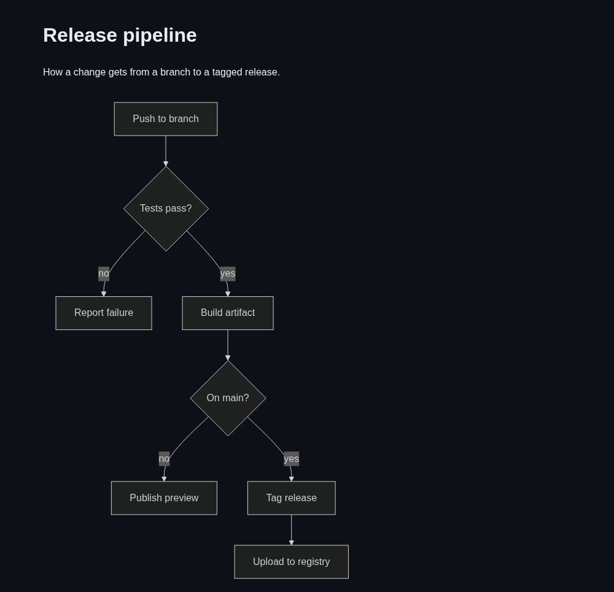

# Markko

A lightweight GitHub-flavored Markdown viewer with Mermaid diagram support and live reload. Built as a small Python CLI instead of an Electron/Tauri app — no Node or Rust toolchain, no packaging pipeline, just `pip install`.



## Features

- GFM: tables, task lists, strikethrough, footnotes, fenced code blocks with syntax highlighting (Pygments)
- Mermaid diagrams: ` ```mermaid ` fences render as real flowcharts/sequence diagrams via mermaid.js
- Live preview: the page polls the file's mtime and reloads automatically on save
- Dark/light theme via `prefers-color-scheme`, which tracks the system GTK theme on Fedora/GNOME
- Opens in your default browser — no bundled webview
- First run prints a big purple "MARKKO!!" ASCII banner with an owl; every launch after that plays a short sparkle-spinner, in the style of Claude Code's startup flourish. Both fall back to plain text when output isn't a terminal.

## Install

```bash
python3 -m venv .venv && source .venv/bin/activate   # or install --user without a venv
pip install .
```

## Usage

```bash
markko notes.md                 # renders and opens in your browser, live-reloads on save
markko notes.md --no-open       # just start the server, print the URL
markko notes.md --port 8080     # pin the port (default: random free port)
```

## Set as default app for `.md` files

```bash
cp markko.desktop ~/.local/share/applications/
update-desktop-database ~/.local/share/applications
xdg-mime default markko.desktop text/markdown
```

## Tests

```bash
python test_markko_cli.py
```

## Notes

- Mermaid.js is loaded from a CDN (jsdelivr); an internet connection is needed for diagrams to render.
- No native window, RPM, or Flatpak packaging — this targets a single-machine dev workflow. A native window is a one-line swap to `pywebview` if you want it later.
